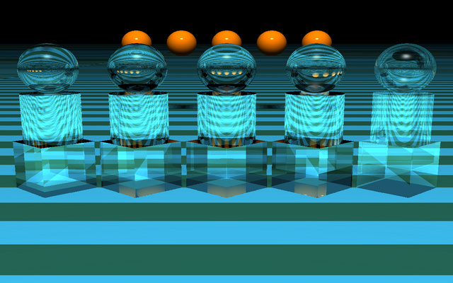
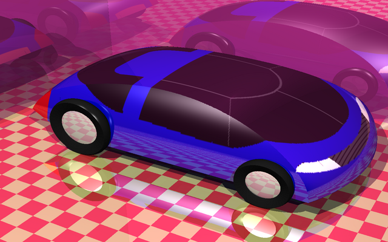
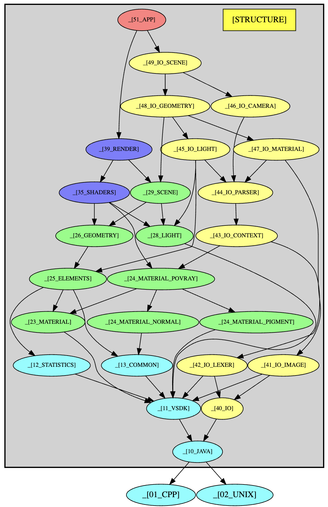

# POV-Ray 1.0 — Modern C++ Rewrite

A faithful rewrite of [POV-Ray 1.0 (1992)](https://www.povray.org/) in modern C++.
The renderer is **100% compatible** with the original POV-Ray 1 scene description language and
produces **pixel-identical output** to the reference implementation across the full original
scene test suite (108 scenes).

| `iortest.pov` — refraction / IOR | `car.pov` — complex scene |
|:---:|:---:|
|  |  |

## What it is

POV-Ray 1 is a classic recursive ray tracer from 1992. This project reimplements the same
rendering algorithm and scene parser from scratch in idiomatic modern C++, replacing the
original monolithic C translation unit with a layered, object-oriented architecture while
preserving every visible behaviour: same primitives, same solid-texture pipeline, same
lighting model, same numerical output.

**Compatibility guarantees:**
- Scene files written for POV-Ray 1 render without modification. Both `color` and `colour`
  spellings are accepted everywhere in `.pov` files, as in the original.
- Output images are bit-for-bit identical to those produced by the reference build, verified
  with ImageMagick's `AE` (absolute error) metric against a golden image corpus.

## Features

**Geometry primitives**
- Sphere, box, infinite plane
- Quadric surfaces (general second-degree equation)
- Poly / quartic surfaces (higher-degree polynomial shapes)
- Blob (implicit metaball-style surfaces with configurable threshold)
- Height field (GIF, POT, TGA elevation maps)
- Triangle and smooth triangle (Phong normal interpolation)
- Bicubic Bézier patch
- CSG: union, intersection, difference, composite

**Solid textures**
- Procedural patterns: checker, marble, wood, granite, agate, bozo, onion, leopard,
  spotted, gradient
- Procedural bumps: ripples, waves, bumps, dents, wrinkles, bumpy1/2/3
- Image-based: `image_map` (planar, spherical, cylindrical, toroidal mapping),
  `bump_map`, `material_map`
- Color maps with linear interpolation

**Lighting & shading**
- Phong and Blinn-Phong specular highlights
- Lambertian diffuse
- Ambient light
- Point lights and spotlights with `falloff`, `tightness`, and `radius`
- Hard shadows
- Mirror reflection (recursive ray tracing)
- Refraction / transmission with index of refraction and Snell's law
- Exponential atmospheric fog

**Image output**
- Targa (TGA) — primary output format
- Raw dump (`.dis`) — scanline-based intermediate format
- IFF (Amiga) and raw RGB

## Architecture

The codebase is organised in self-contained layers. Each layer depends only on those below it.

The diagram below was generated directly from the source code using
[dependencyGraphAnalyzer](https://github.com/OscarChavarro/dependencyGraphAnalyzer).



| Layer | Package | Responsibility |
|---|---|---|
| **Application** | `src/app` | Entry point, CLI option parsing, output adapter |
| **IO — Scene parser** | `src/io/pov` | Lexer (`Tokenizer`), recursive-descent parser, AST lowering into the scene model |
| **IO — Image formats** | `src/io/image` | Reading and writing TGA, GIF, IFF, raw dump |
| **Environment** | `src/environment` | Scene graph (`SceneFrame`), geometry primitives, camera, lights, CSG tree |
| **Solid textures** | `src/solidTexture` | Solid texture evaluation, indexed palette images, image-map sampling |
| **Render** | `src/render` | `RenderEngine` drives scanline rendering; `RayShaderPipeline` chains per-intersection shaders |
| **Shaders** | `src/render/shaders` | One class per shading effect (ambient, Lambert, Phong, shadow, reflection, refraction, fog, bump) |
| **Processing** | `src/processing` | Sturm-sequence polynomial root solver used by quartics and polys |
| **Base library** | `base/` | Vitral toolkit: linear algebra (`Vector3Dd`, `Matrix4x4d`), image buffers, I/O primitives |

The shader chain is assembled at startup by `RayShaderPipeline`. Recursive calls
(reflection, refraction, shadow) are dispatched through a `TraceService` function-pointer
pair so shaders remain decoupled from the top-level trace loop.

## Building

### Prerequisites

| Tool | Minimum version | Notes |
|---|---|---|
| C++ compiler | GCC 11 or Clang 14 | C++11 required |
| CMake | 3.16 | |
| ImageMagick | 6 or 7 | Required for `testAgainstGoldenImages.sh` and `viewImages.sh` |
| clang-tidy + clang-format | any recent | Optional, required for `lint.sh` |
| gcovr or lcov + genhtml | any | Optional, required for coverage reports |

### Linux / macOS

```bash
# 1. Clone
git clone https://github.com/OscarChavarro/povCpp.git
cd povCpp

# 2. Build
./scripts/compile.sh

# The binary is placed at build/povray
```

### Running a scene

```bash
./build/povray \
    +l/path/to/include \
    +i scene.pov \
    +o output.tga \
    +w1280 +h800
```

Common options (inherited from the original POV-Ray 1 command-line interface):

| Option | Meaning |
|---|---|
| `+i<file>` | Input scene file |
| `+o<file>` | Output image file |
| `+l<path>` | Include search path |
| `+w<n>` | Image width in pixels |
| `+h<n>` | Image height in pixels |
| `-d` | Disable display output |
| `-v` | Verbose mode |
| `+ft` | Output format: Targa |
| `+x` | Enable early exit on error |

## Scripts

All scripts live in `scripts/` and are run from the repository root.

### `clean.sh`
Removes the `build/` and `output/` directories, generated `.tga` files, and editor
temporary files. Run this before a fresh build.

```bash
./scripts/clean.sh
```

### `compile.sh`
Configures and builds with CMake using all available CPU cores. Accepts any extra CMake
flags as arguments (forwarded verbatim to `cmake -S . -B build`). After a successful build,
copies `compile_commands.json` to the root for IDE and linter use.

```bash
./scripts/compile.sh
# With extra flags:
./scripts/compile.sh -DCMAKE_BUILD_TYPE=Debug
```

### `renderAll.sh`
Renders the full test suite of 108 `.pov` scenes drawn from the original POV-Ray 1
distribution, organised in four groups:

| Directory | Description |
|---|---|
| `etc/level1/` | Basic primitives, simple lighting, introductory textures |
| `etc/level2/` | CSG, height fields, spotlights, atmospheric effects |
| `etc/level3/` | Complex multi-object scenes (car, chess set, teapot, ionic column…) |
| `etc/math/` | Mathematical surfaces — quartics, Bézier patches, parametric shapes |

All scenes run in parallel and output TGA files to `output/`.

```bash
./scripts/renderAll.sh
```

### `testAgainstGoldenImages.sh`
Compares every generated `.tga` in `output/` against the reference corpus in
`../referenceTestImages/` using ImageMagick's `AE` (absolute pixel error) metric.
Exits with a non-zero status if any image differs or is missing.

```bash
./scripts/testAgainstGoldenImages.sh
# Expected output: Test passed.
```

### `lint.sh`
Runs `clang-tidy` and `clang-format` against source files matched by a path or regex.
Two modes:

```bash
# Static analysis only (does not modify files):
./scripts/lint.sh --check src/render/.*

# Apply automatic fixes and reformat:
./scripts/lint.sh --fix src/render/.*
```

Override the check set or format style via environment variables:
```bash
LINT_CHECKS='modernize-*' ./scripts/lint.sh --fix src/.*
```

### `viewImages.sh`
Builds a side-by-side comparison (reference | generated | diff) for every scene and
displays the result in the terminal using [Sixel](https://en.wikipedia.org/wiki/Sixel)
graphics. Requires a Sixel-capable terminal (e.g. iTerm2, mlterm, xterm -ti vt340).

```bash
./scripts/viewImages.sh
```

### `renderAllWithCoverage.sh`
Recompiles the project with `gcov` instrumentation, runs the full render suite, and
generates an HTML coverage report under `build/coverage/index.html`. Requires `gcovr`
(preferred) or `lcov` + `genhtml`.

```bash
./scripts/renderAllWithCoverage.sh
open build/coverage/index.html
```

### `parseCoverage.sh`
Parses each `.pov` scene file through the tokenizer/parser only (no rendering) and
reports which scenes parse successfully. Useful for quickly iterating on parser changes.

```bash
./scripts/parseCoverage.sh
```

## Full verification workflow

```bash
./scripts/clean.sh
./scripts/compile.sh
./scripts/renderAll.sh
./scripts/testAgainstGoldenImages.sh
```

A passing run prints `Test passed.` with zero failures across all 108 scenes.

## Project objectives

- **Education.** The primary goal is to serve as a learning resource for computer graphics
  courses. The codebase is intentionally structured so that each algorithm — BVH traversal,
  CSG evaluation, texture projection, the Phong shading model, Snell's law refraction — can
  be studied in isolation. A curated set of reference materials is included in `doc/references/`,
  and specific sections of the source code are annotated with citations that link directly to
  the relevant pages of those texts.

- **Vulkan rendering variant.** A longer-term objective is to port the rendering pipeline to
  Vulkan, using this codebase as the functional specification. The clean separation between
  scene representation and shading makes it a suitable starting point for a GPU-accelerated
  implementation.

- **Case study for the Vitral library.** This project also acts as a real-world integration
  test for [Vitral](https://github.com/OscarChavarro/vitral), a companion C++ toolkit that
  provides the linear algebra, image buffer, and I/O primitives used here. Both projects share
  the same design principles and evolve together.

- **Fun.** POV-Ray is one of the most entertaining programs ever written. Watching a
  mathematically correct image of a glass teapot or a Steiner surface materialise one
  scanline at a time never gets old.

- **Tribute.** This project is dedicated to the original POV-Ray Team — David Buck,
  Aaron Collins, and all contributors who, in 1992, shipped a free, portable, cross-platform
  ray tracer of remarkable quality and made it available to the world. Their work has inspired
  countless developers and remains a landmark in the history of computer graphics.
